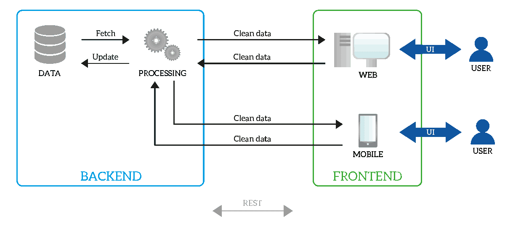
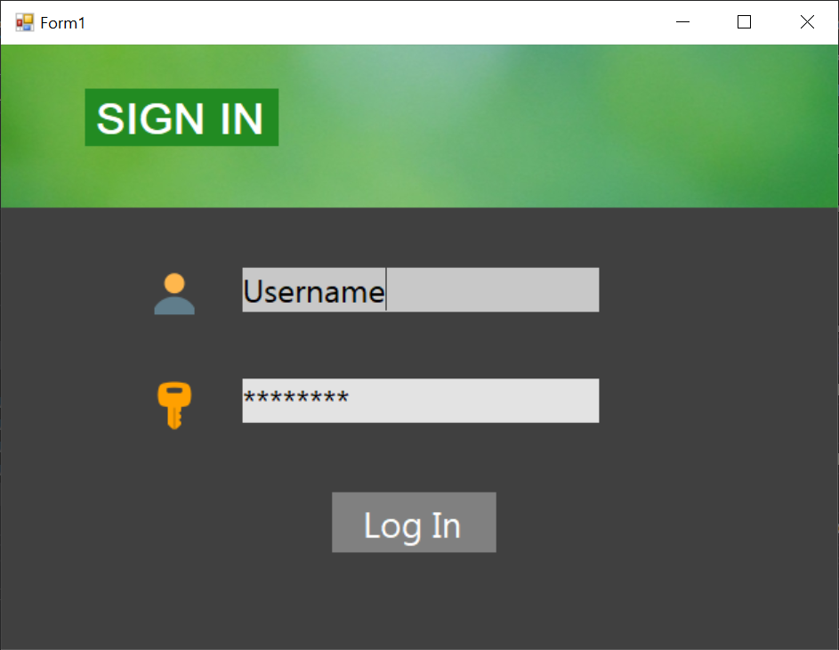
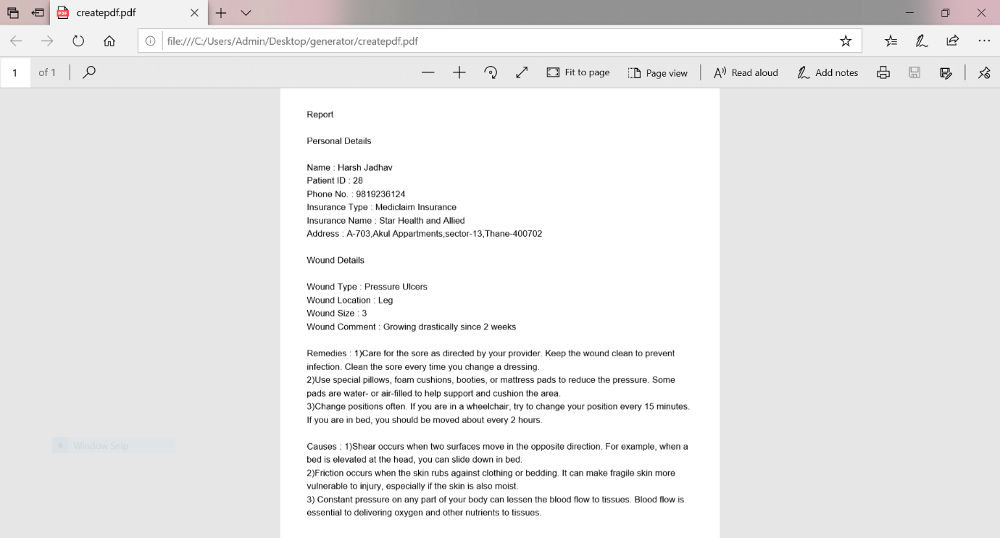

# -Ulcer-patient-s-report-management-system
A DBMS project using T-SQL in C# made by Hardik Deshmukh

**1. Introduction**

  1. **Windows Application:-**

Windows Application is a two tier client server database application. It uses Windows Desktop application to perform a particular task. The client side scripts which is known as Front End uses c# to present information to user and the server side script which is known as Back End T-SQL to store and retrieve information.

The flow of web application:-

- The User triggers a request to the database through the application or the application&#39;s user interface. The application forwards this request to the database server.
- The application server performs the requested task such as querying the database or processing the data then generates the results of the requested data.
- The application server sends results to the database with the requested information or processed data the server responds back to the client with the requested information that then appears on the user&#39;s display.

Fig 1.1 Structure of The application.

  

**2. Problem Statement**

A patient will have unique ID and Password to log into the application .Then the patient has to fill his details followed by wound details. The wound details contains the attribute wound type which will drop down representing different types of Ulcers. According to wound details this application will give details and remedies about the Ulcer. Based on this database the doctor can log in and search for patient&#39;s details about the wound. The doctor will be able to view entire database and the patient will have his report generated.

**2.1 ER Diagram:-**

  

Over here we see three relations. The account has id as primary key, patient has patient\_id as primary key and wound has patient\_id as primary key. The accounts contains username and password for two different users i.e. doctors and patients.

The patient contains all his personal details and the wound holds all his wound details. This information is stored in database and a final report is generated with remedies and causes of wound. The remedies and causes are determined by the wound type. And for the doctor the entire database is viewable and he can search and delete particular row.

**2.2 Relation database:-**

A relational database is a set of formally described tables from which data can be accessed or reassembled in many different ways without having to reorganize the database tables. The standard user and application programming interface ([API](https://searchmicroservices.techtarget.com/definition/application-program-interface-API)) of a relational database is the Structured Query Language ([SQL](https://searchsqlserver.techtarget.com/definition/SQL)). SQL statements are used both for interactive queries

for information from a relational database and for gathering data for reports. Each table, which is sometimes called a _relation_, in a relational database contains one or more data.

Categories in columns, or _attributes_. Each [row](https://searchoracle.techtarget.com/definition/row), also called a _record_ or _[tuple](https://whatis.techtarget.com/definition/tuple)_, contains a unique instance of data, or _key_, for the categories defined by the columns. Each table has a unique [primary key](https://searchsqlserver.techtarget.com/definition/primary-key), which identifies the information in a table. The relationship between tables can then be set via the use of [foreign keys](https://searchoracle.techtarget.com/definition/foreign-key) -- a field in a table that links to the primary key of another table.For example, a typical business order entry database would include a table that described a customer with columns for name, address, phone number and so forth. Another table would describe an order: product, customer, date, sales price and so forth. A user of a relational database can then obtain a [view](https://searchsqlserver.techtarget.com/definition/view) of the database to fit their needs. For example, a branch office manager might like a view or report on all customers that bought products after a certain date. A financial services manager in the same company could, from the same tables, obtain a report on accounts that need to be paid. When creating a relational database, you can define the [domain](https://whatis.techtarget.com/definition/domain) of possible values in a data column and further [constraints](https://whatis.techtarget.com/definition/constraint-project-constraint) that may apply to that data value. For example, a domain of possible customers could allow up to 10 possible customer names but be constrained in one table to allowing only three of these customer names to be specifiable. Two constraints relate to data integrity and the primary and foreign keys:

**Entity integrity**  ensures that the primary key in a table is unique and that the value is not set to [null](https://whatis.techtarget.com/definition/null-set).

**Referential integrity**  requires that every value in a foreign key column will be found in the primary key of the table from which it originated.

**2.3 Front End:-**

**Windows Forms**  (WinForms) is a graphical (GUI) class library included as a part of Microsoft .NET Framework or Mono Framework,[1] providing a platform to write rich client applications for desktop, laptop, and tablet PCs

**Windows Forms**  (WinForms) is a graphical (GUI) class library included as a part of Microsoft .NET Framework or Mono Framework, providing a platform to write rich client applications for desktop, laptop, and tablet PCs All visual elements in the Windows Forms class library derive from the Control class. This provides the minimal functionality of a user interface element such as location, size, color, font, text, as well as common events like click and drag/drop. The Control class also has docking support to let a control rearrange its position under its parent. The Microsoft Active Accessibility support in the Control class also helps impaired users to use Windows Forms better.Besides providing access to native Windows controls like button, textbox, checkbox and listview, and Windows Forms.The DataGridView control makes it easy to define the basic appearance of cells and the display formatting of cell values. The cell is the fundamental unit of interaction for the DataGridView. All cells derive from the DataGridViewCell base class. Each cell within the DataGridView control can have its own style, such as text format, background color, foreground color, and font. Typically, however, multiple cells will share particular style characteristics. The data type for the cell&#39;s Value property by default is of type ObjThe DataGridView can display data in Bound mode, unbound mode and Virtual mode . Bound mode is suitable for managing data using automatic interaction with the data store. One very common use of the DataGridView control is binding to a table in a database. Unbound mode is suitable for displaying relatively small amounts of data that you manage programmatically.

**3. System Description**

Structured Query Language(SQL) as we all know is the database language by the use of which we can perform certain operations on the existing database and also we can use this language to create a database. SQL uses certain commands like Create, Drop, Insert etc. to carry out the required tasks.

**3.1 DDL ,DQL AND DML:-** DDL or Data Definition Language actually consists of the SQL commands that can be used to define the database schema. It simply deals with descriptions of the database schema and is used to create and modify the structure of database objects in the database.

**Examples of DDL commands:**

[**CREATE**](https://www.geeksforgeeks.org/sql-create/) – is used to create the database or its objects (like table, index, function, views, store procedure and triggers).

[**DROP**](https://www.geeksforgeeks.org/sql-drop-truncate/) – is used to delete objects from the database.

[**ALTER**](https://www.geeksforgeeks.org/sql-alter-add-drop-modify/)-is used to alter the structure of the database.

[**TRUNCATE**](https://www.geeksforgeeks.org/sql-drop-truncate/)–is used to remove all records from a table, including all spaces allocated for the records are removed.

[**COMMENT**](https://www.geeksforgeeks.org/sql-comments/) –is used to add comments to the data dictionary.

[**RENAME**](https://www.geeksforgeeks.org/sql-alter-rename/)–is used to rename an object existing in the database.

The SQL commands that deals with the manipulation of data present in the database belong to DML or Data Manipulation Language and this includes most of the SQL statements.

**Examples of DML:**

[**INSERT**](https://www.geeksforgeeks.org/sql-insert-statement/) – is used to insert data into a table.

[**UPDATE**](https://www.geeksforgeeks.org/sql-update-statement/) – is used to update existing data within a table.

[**DELETE**](https://www.geeksforgeeks.org/sql-delete-statement/) – is used to delete records from a database table.

DML statements are used for performing queries on the data within schema objects. The purpose of DQL Command is to get some schema relation based on the query passed to it.

**Example of DQL:**

[**SELECT**](https://www.geeksforgeeks.org/sql-select-clause/) – is used to retrieve data from the database.

**3.2 SQL QUERIES:-**

Structured Query Language is a standard Database language which is used to create, maintain and retrieve the relational database. Following are some interesting facts about SQL.

SQL is case insensitive. But it is a recommended practice to use keywords (like SELECT, UPDATE, CREATE, etc) in capital letters and use user defined things (liked table name, column name, etc) in small letters.

We can write comments in SQL using &quot;–&quot; (double hyphen) at the beginning of any line.

SQL is the programming language for relational databases (explained below) like MySQL, Oracle, Sybase, SQL Server, Postgre, etc. Other non-relational databases (also called NoSQL) databases like MongoDB, DynamoDB, etc do not use SQL

Although there is an ISO standard for SQL, most of the implementations slightly vary in syntax. So we may encounter queries that work in SQL Server but do not work in MySQL.

**3.3 Join Operations:-** A SQL Join statement is used to combine data or rows from two or more tables based on a common field between them. Different types of Joins are:

- INNER JOIN
- LEFT JOIN
- RIGHT JOIN
- FULL JOIN

**INNER JOIN:**  The INNER JOIN keyword selects all rows from both the tables as long as the condition satisfies. This keyword will create the result-set by combining all rows from both the tables where the condition satisfies i.e value of the common field will be same.

Syntax:- SELECT table1.column1,table1.column2,table2.column1,....

FROM table1

INNER JOIN table2

ON table1.matching\_column = table2.matching\_column;

**LEFT JOIN** : This join returns all the rows of the table on the left side of the join and matching rows for the table on the right side of join. The rows for which there is no matching row on right side, the result-set will contain _null_.

LEFT JOIN is also known as LEFT OUTER JOIN. **Syntax:**

SELECT table1.column1,table1.column2,table2.column1,....

FROM table1

LEFT JOIN table2

ON table1.matching\_column = table2.matching\_column;

**RIGHT JOIN** : RIGHT JOIN is similar to LEFT JOIN. This join returns all the rows of the table on the right side of the join and matching rows for the table on the left side of join. The rows for which there is no matching row on left side, the result-set will contain _null_. RIGHT JOIN is also known as RIGHT OUTER JOIN. **Syntax:**

SELECT table1.column1,table1.column2,table2.column1,....

FROM table1 RIGHT JOIN table2

ON table1.matching\_column = table2.matching\_column;

table1: First table.

table2: Second table

matching\_column: Column common to both the tables.

**FULL JOIN:**  FULL JOIN creates the result-set by combining result of both LEFT JOIN and RIGHT JOIN. The result-set will contain all the rows from both the tables. The rows for which there is no matching, the result-set will contain _NULL_ values. **Syntax:**

SELECT table1.column1,table1.column2,table2.column1,....

FROM table1

FULL JOIN table2 ON table1.matching\_column = table2.matching\_column;

 **4. Results &amp; Snapshots of the system**

  

Fig: Login Page for two different users.

  

Fig: Adding Personal details.

  

 

Fig: Adding Wound details.

  

Fig. Report generated.

  

Fig: Doctor&#39;s End view of database.

  

Fig: Report generated for patient.

**5. Conclusion**

In the present work ,the build of application based on analyzing and generating report on on Ulcers wound has been completed successfully. Implementation of several SQL operations and features such as DDL, DML,DQL,SQL Query and Join operations were gracefully implemented . Several experiments were initially carried out using software&#39;s such as visual studio and SQL.Overall, the build of the application with language c# in visual studio and using database T-SQL was successful.
